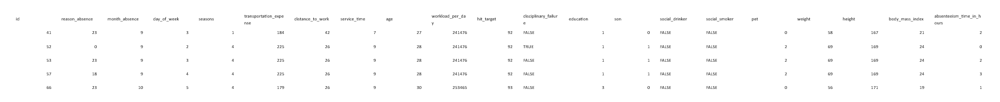
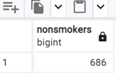
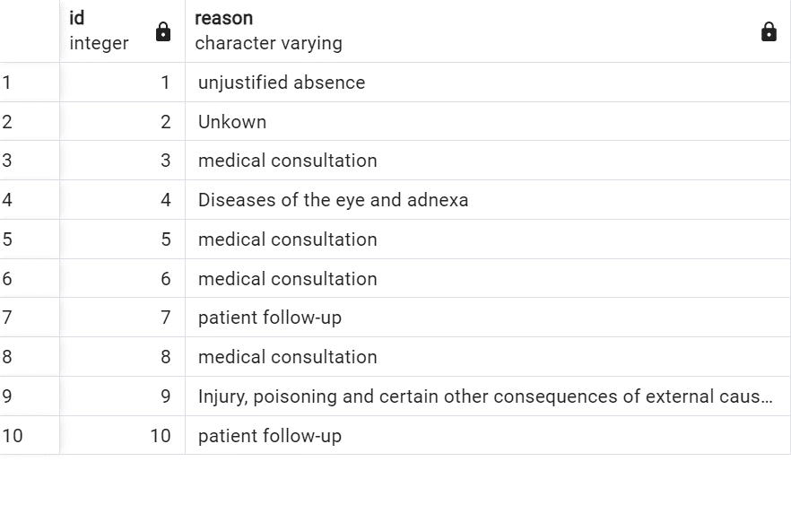
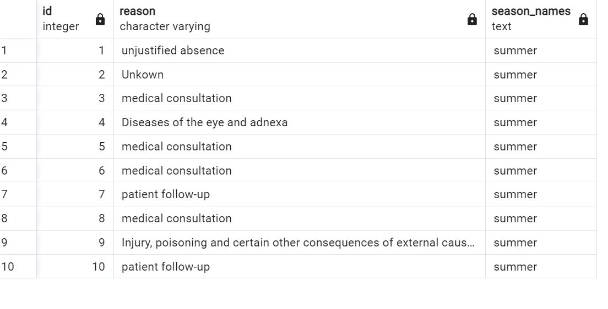
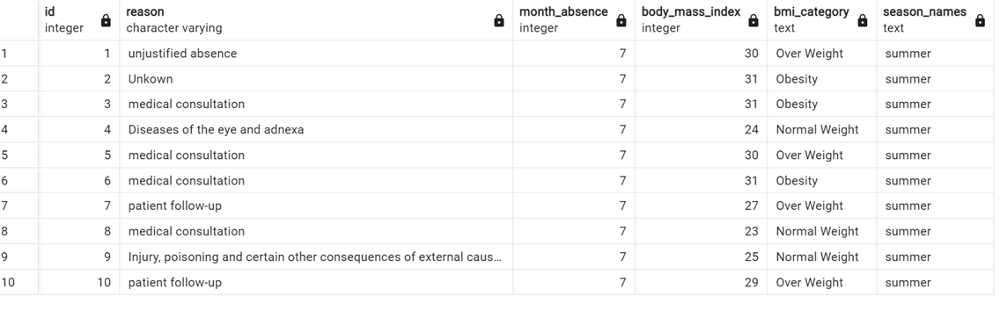
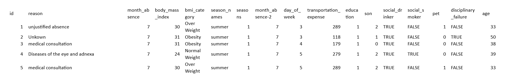
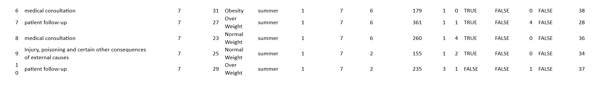

How to join the related tables of absenteeism ?
Find the healthiest person from the database?
 What is the compensation rate increase for non-smokers?
Optimize the query ?
Optimize the query creating seasons column along with the reason column?
Optimize the query retreive the data of  seasons and the person BMI Categories?

**-- Creating join table **

select * from absenteeism_work a

left join work_compensation b

on a.id = b. work_id

left join work_reasons c 

on a.reason_absence = c.id;

We can see the main table named absenteeism_work has been joined and the below is the image of displayed columns of two sub tables in absenteeism_work.

**--Finding the healthiest**

select * from absenteeism_work

where social_drinker = false and social_smoker = false

and body_mass_index <25 and

absenteeism_time_in_hours < (select avg(absenteeism_time_in_hours) from absenteeism_work)

LIMIT 5;

Retrieved the top 5 healthiest individuals based on criteria from four columns: `social_drinker`, `social_smoker`, `body_mass_index`, and `absenteeism_time_in_hours`. A person is deemed healthier if they don't drink or smoke socially, have a body mass index less than 25, and their absenteeism time is below the average.

**---compensation rate increase for non-smokers/budget $983,221 so .68 increase per hour/$1,414 per year**

select count(*) as nonsmokers from absenteeism_work

where social_smoker = false;

 

**--optimize this query**

select

a.id,

r.reason

from absenteeism_work a

left join work_compensation b

on a.id = b.work_id

left join work_reasons r on

a.reason_absence = r.id

LIMIT 10;

**--optimize this query (creating a seasons column with case statement)**

select

a.id,

r.reason,

CASE WHEN Month_absence IN (12,1,2) THEN 'Winter'

     WHEN Month_absence IN (3,4,5) THEN 'spring'
     
	 WHEN Month_absence IN (6,7,8) THEN 'summer'
  
	 WHEN Month_absence IN (9,10,11) THEN 'Fall'
  
	 ELSE 'Unknown' END as season_names
  
from absenteeism_work a

left join work_compensation b

on a.id = b.work_id

left join work_reasons r on

a.reason_absence = r.id

Limit 10;

 
**--optimize this query(with BMI Category and seasons column using Case statements)**

select

a.id,

r.reason,

month_absence,

body_mass_index,

CASE WHEN body_mass_index <18.5 THEN 'Under Weight'

     WHEN body_mass_index between 18.5 and 25 THEN 'Normal Weight'
     
     WHEN body_mass_index between 25 and 30 THEN 'Over Weight'
     
	 WHEN body_mass_index >18.5 THEN 'Obesity'
  
	 ELSE 'Unknown' END as BMI_Category,
  
CASE WHEN Month_absence IN (12,1,2) THEN 'Winter'

     WHEN Month_absence IN (3,4,5) THEN 'spring'
     
	 WHEN Month_absence IN (6,7,8) THEN 'summer'
  
	 WHEN Month_absence IN (9,10,11) THEN 'Fall'
  
	 ELSE 'Unknown' END as season_names
  
from absenteeism_work a

left join work_compensation b

on a.id = b.work_id

left join work_reasons r on

a.reason_absence = r.id

LIMIT 10;

 

**The query with added fields to use it to represent overall data -**

select

a.id,

r.reason,

month_absence,

body_mass_index,

CASE WHEN body_mass_index <18.5 THEN 'Under Weight'

     WHEN body_mass_index between 18.5 and 25 THEN 'Normal Weight'
     
     WHEN body_mass_index between 25 and 30 THEN 'Over Weight'
     
	 WHEN body_mass_index >18.5 THEN 'Obesity'
  
	 ELSE 'Unknown' END as BMI_Category,
  
CASE WHEN Month_absence IN (12,1,2) THEN 'Winter'

     WHEN Month_absence IN (3,4,5) THEN 'spring'
     
	 WHEN Month_absence IN (6,7,8) THEN 'summer'
  
	 WHEN Month_absence IN (9,10,11) THEN 'Fall'
  
	 ELSE 'Unknown' END as season_names,
  
seasons,
month_absence,
day_of_week,
transportation_expense,
education,
son,
social_drinker,
social_smoker,
pet,
disciplinary_failure,
age
from absenteeism_work a

left join work_compensation b

on a.id = b.work_id

left join work_reasons r on

a.reason_absence = r.id

LIMIT 10;

